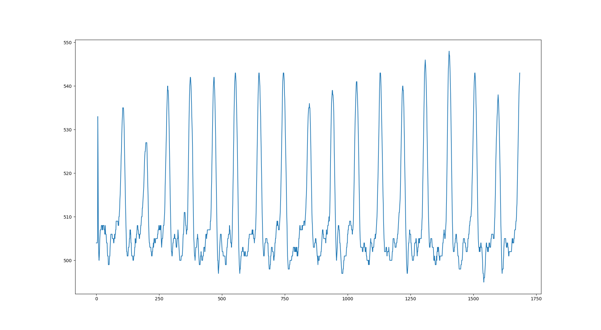
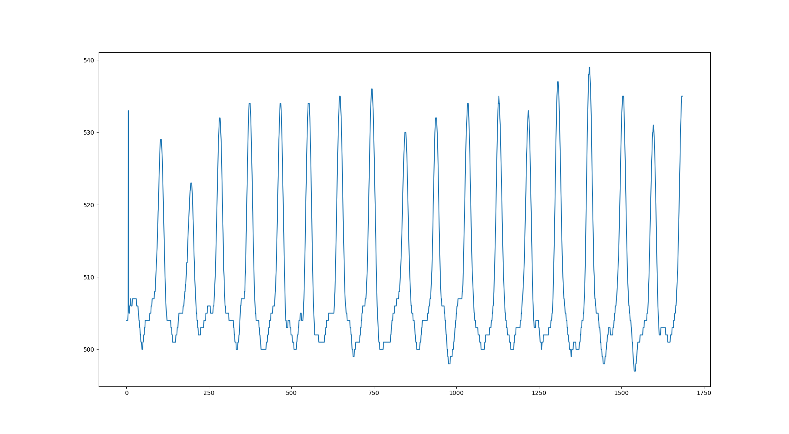

# RTOS Assignment 1
For a given ECG signal, smoothen the curve, find the peaks and count the number of heartbeats using C.
The input ECG data file is [here](Samples.xlsx)

#### Smoothening the Data
- Used a window smoothening method which takes mean of a given neighbouring points for every point and re-plos
- Instead of the mean, median method can also be used but there are complications in it.
- Depending on the window size inputted the curve changes which can become smoother or harder.

##### Plot of given Data

##### Plot of smoothened Data

#### Finding Peaks
- To find the peaks, I used the simplest of all methods i.e to find the local maxima comparing it to a set of given number of neigbouring points and with a given threshold.

#### Plotting
- I found it difficult to plot using C, so to do the plotting I wrote a simple Python script which takes the input of data given by the C program.
- To run the program and plot the graph at a single click I wrote a small shell script.
