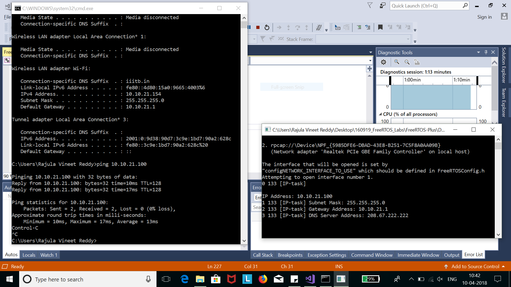

# Assignment 7

## Compiling FreeRTOS using Visual Studion on Windows

- Install viusal studio community edition (or any) on your Windows machine
- Install the C++ dev kit
- Download the FreeRTOS code from [Source Forge](https://sourceforge.net/projects/freertos/files/latest/download?source=files)
- Extract the file sand navigate to the folder ```FreeRTOSvx.x.x/FreeRTOS-Plus/Demos/FreeRTOS_Plus_TCP_Minimal_Windows_Simulator/```
- Load the file **FreeRTOS_Plus_TCP_Minimal.sln** in Visual Studion
- Change the DHCP value to 0 in **FreeRTOSIPConfig.h**
- Change the fields IP address, Subnet, Gateway in **FreeRTOSConfig.h** according to the host settings like in the command **ipconfig**
- Build the proj and run simulator
- Ping the IP address from your system in the same network


